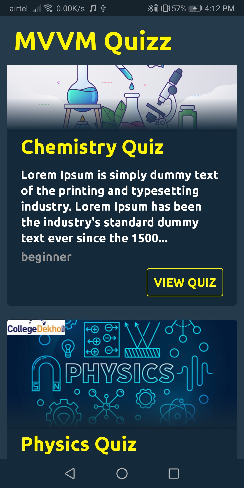
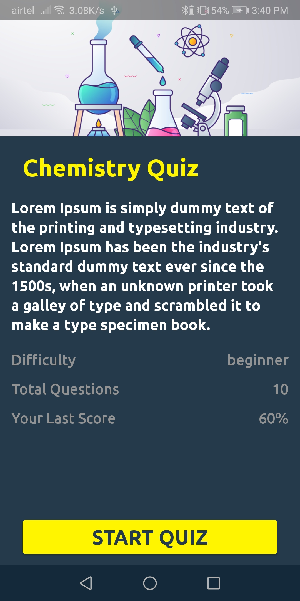
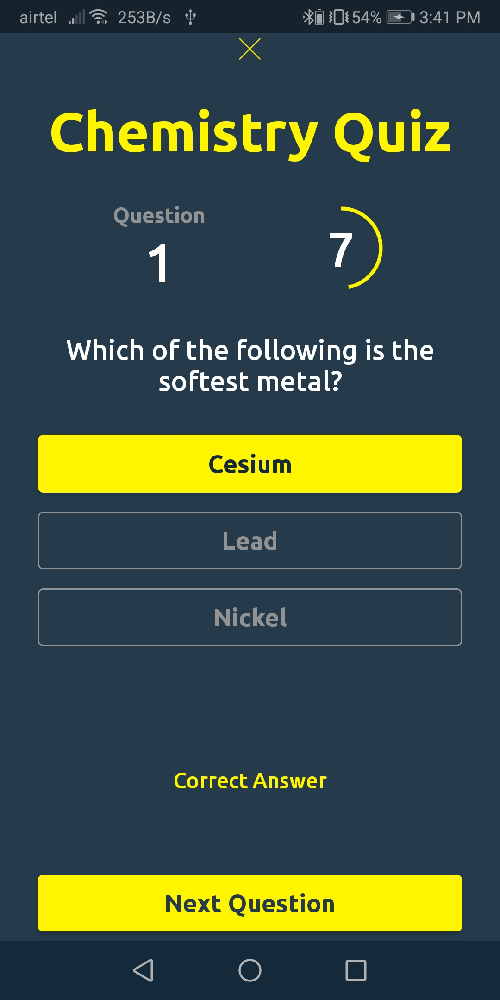
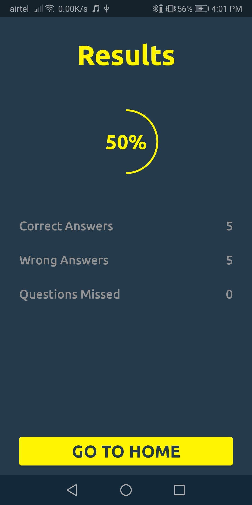

# DESCRIPTION

App Name - **MVVM** **QuizzApp**

A QuizzApp using **android** **architecture** components and following **MVVM** architecture.

Uses Firebase Firestore, Firebase Auth, Firebase Storage, **Android** **JetPack** Navigation.

# FEATURES

1. User Authentication
2. Displays List of available Quiz
3. Displays Previous Results
4. Update UI after answering a question or when timer terminates
5. Displays Results
6. Uses Animations for Fragment Transitions
7. Uses Android Jetpack Navigation 

# GETTING STARTED

1. Clone the Project
2. Change Package Name
2. Connect The app to Firebase
3. Add google-services.json file

# APPLICATION FLOW

 | LOGIN | QUIZZ LIST | QUIZ DETAILS |
 --------------|------------|-------------|
 |  |   |  
 
 | CORRECT ANS | WRONG ANSWERS | RESULTS |
 -------------|-------------|-------------|
 |  |  | 

# WHAT DID I LEARNED ?

1. MVVM Architecture pattern
2. Using Android Architecture Components
3. Using Android JetPack for Navigation between Fragments
4. Passing Data between Fragments using Safe Args
5. Using Animation in navigation between Fragments
6. Using Firebase Firestore

# DEPENDENCIES

    `// JETPACK NAVIGATION
    def nav_version = "2.3.0"
    implementation "androidx.navigation:navigation-fragment:$nav_version"
    implementation "androidx.navigation:navigation-ui:$nav_version"

    // GLIDE
    implementation 'com.github.bumptech.glide:glide:4.11.0'
    annotationProcessor 'com.github.bumptech.glide:compiler:4.11.0'

    //FIREBASE AUTH
    implementation 'com.google.firebase:firebase-auth:19.4.0'

    // FIREBASE STORAGE
    implementation 'com.google.firebase:firebase-storage:19.2.0'

    //FIREBASE FIRESTORE
    implementation 'com.google.firebase:firebase-firestore:21.6.0'`

### **NOTE** - Data is added manually in FirebaseFirestore. The Data is Derived in App Using MVVM Architecture 
